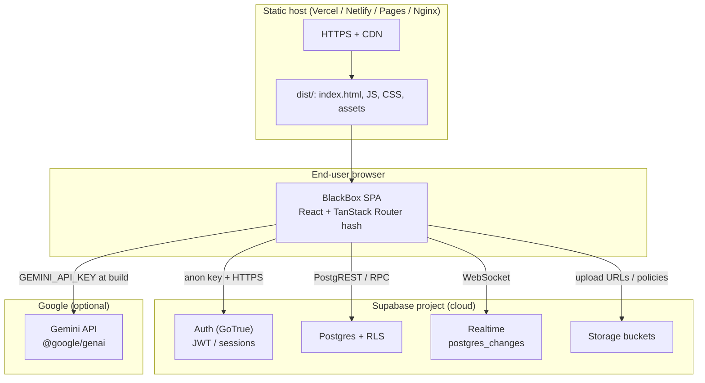
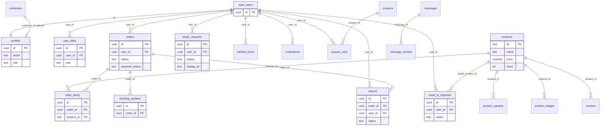

# BlackBox (blackbok-tech) — System Documentation

This document describes the **BlackBox** customer-facing storefront and **admin/staff** operations console: architecture, configuration, routing, data flows, and deployment. It is intended for engineers maintaining or extending the system.

---

## Documentation framework (8 sections × ~30 subsections)

This project aims for a **full technical standard**: **8 parent sections** and roughly **30 numbered subsections**, so a developer can work on BlackBox **without relying on undocumented tribal knowledge**.

**Reality check:** earlier revisions of this file covered only part of that surface. The items that **most often block** a new engineer are: (1) a trustworthy **ERD**, (2) a **roles × RLS × UI** matrix before launch, (3) **who** advances each **order / repair / trade** status, and (4) **where** each environment **runs** and which **env vars** apply.

**Standard map (where the 8 sections live in *this* document):**

| # | Standard parent topic | Primary location in this file |
|---|-------------------------|-------------------------------|
| 1 | Product scope & users | §1 |
| 2 | Tech stack, **runtime architecture diagram** | **§2** (table + **§2.1** diagram), §3 |
| 3 | Configuration & secrets | §4, §21, §23 |
| 4 | **Data model, ERD, RLS** | **§15** (start with **§15.1 ERD**) |
| 5 | **Lifecycles & state machines** | **§16–§18** (status tables + **who changes**) |
| 6 | **AuthZ / roles / permissions** | §7, **§19** (matrix + admin UI gates) |
| 7 | **Build, deploy, hosting, costs, ownership** | §11–§13 (**§12.1** post‑deploy smoke), **§22.4** env separation, **§23** (incl. **§23.5** costs, **§23.6** contacts) |
| 8 | QA, testing, regression, **environment separation** | §22 (incl. **§22.4**) |

**Authoring order (recommended):** ERD first (§15.1) → RLS alignment → lifecycle actors → deployment truth. This revision implements that order for §15–§19 and §23.

**Beyond the 8×30 map (handoff & ops):** §24 *Known limitations / v2*, §25 *Product runbook*, §26 *Documentation change log*, §27 *Glossary*.

---

## 1. Product overview

BlackBox is a **single-page application (SPA)** for:

- **E‑commerce**: product catalog, product detail, cart, checkout, order history, receipts, tracking, promotions, compare, wishlist patterns.
- **Services**: repair requests/scheduling, trade‑in requests, returns.
- **Accounts**: sign‑up, email verification, login, profile, password reset.
- **Admin / staff**: orders, customers, catalog, trade‑ins, repairs, returns, user roles — gated by Supabase roles (`admin`, `staff`).

Backend persistence and auth are provided by **Supabase** (Postgres + Auth + Realtime + Storage as used in code). Optional **Google Gemini** integration supports AI‑assisted features.

---

## 2. Technology stack

| Layer | Technology |
|--------|------------|
| UI | React 19, TypeScript |
| Routing | TanStack Router with **hash history** (`createHashHistory`) |
| Styling | Tailwind CSS (via CDN in `index.html`), `global.css`, theme via `html[data-theme]` + `dark` class |
| Build | Vite 6 |
| Backend | Supabase JS client (`@supabase/supabase-js`) |
| Icons | `lucide-react` |
| AI (optional) | `@google/genai` (Gemini), env `GEMINI_API_KEY` / Vite `define` |

### 2.1 System architecture diagram (internal standard §1.3)

The stack table above lists **what** each layer uses; this diagram shows **how** pieces connect at runtime. A new engineer should read this before touching deploy or env.



**Data flow summary**

1. **Host** serves only static files; there is **no Node server** in this repo’s default deploy path.
2. **SPA** talks **directly** to Supabase (Auth + DB + Realtime + Storage) from the browser using the **anon** key (RLS enforces access).
3. **Gemini** is optional: if `GEMINI_API_KEY` is set at build time, bundled client code may call Google’s API from the **browser** (treat the key as public — restrict in Google Cloud Console by HTTP referrer / quota).

---

## 3. Repository layout

| Path | Purpose |
|------|---------|
| `App.tsx` | Root route tree, `AppContext`, `RouterProvider`, layout (navbar/footer vs standalone routes), auth hydration, realtime subscriptions, `navigateTo` helper |
| `main.tsx` | React mount, initial scroll reset, `StrictMode` |
| `index.html` | Shell, Tailwind CDN config (`darkMode: 'class'`), fonts, meta |
| `views/` | Page-level screens (Home, Store, Checkout, Admin, etc.) |
| `views/admin/` | Admin section components (orders, products, repairs, …) |
| `components/` | Reusable UI (Navbar, Footer, Login, modals, …) |
| `lib/` | Auth, API, Supabase client, utilities (scroll, roles, site URL, …) |
| `hooks/` | React hooks for checkout, admin domains, products, … |
| `services/` | e.g. `geminiService.ts` |
| `database/` | `schema.sql`, `seed.sql`, `migrations/*.sql`, scripts |
| `constants.ts` | e.g. `INITIAL_PRODUCTS` fallback catalog |
| `types.ts` | Shared TypeScript models (products, orders, profiles, …) |
| `global.css` | Design tokens and light‑mode compatibility overrides |

---

## 4. Environment variables

Variables are read via Vite (`import.meta.env`). Typical **development** uses `.env` or `.env.local` at the project root.

| Variable | Required | Description |
|----------|----------|-------------|
| `VITE_SUPABASE_URL` | Yes (production) | Supabase project URL |
| `VITE_SUPABASE_ANON_KEY` | Yes (production) | Supabase anon (public) key |
| `VITE_APP_URL` | Recommended for prod | Public site origin for auth email redirects (`lib/siteUrl.ts`) |
| `GEMINI_API_KEY` | Optional | Google Gemini API key; exposed to client via Vite `define` as `process.env.GEMINI_API_KEY` |

**Note:** `lib/supabase.ts` documents fallbacks for local/dev only; production should rely on explicit env vars (see `DEPLOYMENT.md`).

---

## 5. Application architecture

### 5.1 Entry and routing

- **`main.tsx`** mounts `<App />` which wraps **`RouterProvider`** with a **hash** router (`#/` paths).
- **`App.tsx`** defines `rootRoute` whose component is **`RootComponent`**: holds global React state (products, cart, user, orders, repairs, trades, theme, …) and exposes **`AppContext`**.
- **Child routes** render inside `<Outlet />` either in the **main site shell** (navbar, footer, floating WhatsApp) or **standalone** layouts (no chrome) for focused flows.

### 5.2 Layout modes (`RootComponent`)

- **Standard layout**: `Navbar` + `<main className="flex-1"><Outlet /></main>` + `Footer` + modals/notifications.
- **Standalone routes** (no global navbar/footer): `/admin`, `/forgot-password`, `/reset-password`, `/confirmation`, `/emailconfirm` — full‑screen task flows.

### 5.3 Global state (`AppContext`)

Key fields include: `products`, `cart`, `wishlist`, `compareIds`, `user`, `orders`, `repairs`, `trades`, `searchQuery`, `selectedCategories`, `theme`, `authReady`, `navigateTo`, `notify`, `refreshProducts`, etc.

- **Persistence**: user, cart, orders, repairs, trades, wishlist, compare, theme are mirrored to **`localStorage`** (keys such as `bb_v4_*`) on change.
- **Products**: initial state seeds from **`INITIAL_PRODUCTS`** so the home page never renders empty before the first `getProducts()` response; API still refreshes from Supabase when available.

### 5.4 Scroll and navigation UX

- **`ScrollToTop`** (in `App.tsx`): disables browser scroll restoration and scrolls the document to top on route changes (`lib/scrollToDocumentTop.ts`).
- **`navigateTo`**: wraps TanStack `navigate`; supports `'home'`, paths with optional **`?query`** split into proper **`search`** params (important for hash router). Product navigation uses a second string argument for product id.

### 5.5 Welcome overlay

- **`WelcomeScreen`**: shown until `sessionStorage['bb_v4_welcomed']` is set; main shell uses `opacity-0 pointer-events-none` while welcome is active.
- **`completeWelcome`**: sets session flag, hides welcome, calls **`scrollToDocumentTop`**.

### 5.6 Realtime (customer)

When `user.id` is present and Supabase is configured, `RootComponent` subscribes to Postgres changes on **`orders`**, **`trade_in_requests`**, **`repair_requests`** for that user and refetches lists, with toast notifications on status changes.

---

## 6. Route reference

All paths are **hash routes** (e.g. `https://example.com/#/store`).

| Path | Description |
|------|-------------|
| `/` | Home |
| `/store` | Product listing (search/categories via validated search) |
| `/product/$productId` | Product detail |
| `/cart` | Cart |
| `/checkout` | Checkout |
| `/repair` | Repairs flow |
| `/trades` | Trade‑ins |
| `/profile` | Account (requires `authReady` + session) |
| `/auth` | Login / sign‑up (`Auth.tsx`; optional `message` search for flashes) |
| `/forgot-password` | Password reset request |
| `/reset-password` | Password reset completion (recovery session) |
| `/admin` | Admin dashboard (guarded) |
| `/about`, `/faq`, `/contact` | Marketing / support |
| `/history` | Orders / trades / repairs history (tabs via search) |
| `/tracking/$type/$id` | Tracking UI |
| `/receipt/$orderId`, `/returns`, `/promotions`, `/compare`, `/policies` | Receipts, returns, promos, compare, policies |
| `/confirmation` | Post‑signup “check your email” (`validateSearch`: `email`) |
| `/emailconfirm` | Post‑email‑link “account verified” (`validateSearch`: `email`) |
| `/error` | QA error page |
| `$` | Catch‑all not found |

**Email / auth URL handling:** `App.tsx` inspects `window.location.search` and `window.location.hash` for Supabase markers (`type=recovery`, `type=email_confirm`, `signup`, etc.) and navigates to `/reset-password` or `/emailconfirm` as appropriate. Supabase **`onAuthStateChange`** also routes on `PASSWORD_RECOVERY`.

---

## 7. Authentication and authorization

### 7.1 Client services

- **`lib/auth.ts`** — `AuthService`: sign‑up, sign‑in, sign‑out, password reset, profile resolution, admin session verification, duplicate‑signup detection, resend confirmation, etc.
- **`lib/api.ts`** — Lower‑level Supabase calls: profiles, roles (`user_roles`), products, orders, repairs, trades, admin helpers, coupons, messaging types, etc. Large file; domain sections are commented (e.g. authentication, products, orders).
- **`lib/emailConfirmation.ts`** — Email confirmation status via **current session** (`getSession`), resend, URL token heuristics.
- **`lib/roles.ts`** — `normalizeCanonicalRole`, `canAccessAdminDashboard` (`admin` \| `staff`).

### 7.2 Roles

Canonical app roles: **`user`**, **`staff`**, **`admin`**. Admin UI access uses **`canAccessAdminDashboard`**.

### 7.3 Email verification flow (summary)

1. Sign‑up can redirect to **`/confirmation?email=`** with instructions.
2. Supabase confirmation link should redirect using **`authEmailConfirmRedirectUrl()`** (`lib/siteUrl.ts`): site root + marker + `#/emailconfirm`.
3. **`views/Confirmation.tsx`**: uses session to detect verified email, attempts **auto‑login** via `AuthService.getCurrentUser` + `setUser`, otherwise **`navigateTo('/auth', { search: { message } })`** with **`sessionStorage`** flash key `auth.flash` for **`Login.tsx`**.
4. **`components/Login.tsx`** reads `auth.flash` first, then hash/search `message` param.

### 7.4 Route guards

- **`profileRoute`**, **`historyRoute`**, and similar: wait for **`authReady`**, then show sign‑in wall or content.
- **`adminRoute`**: verifies live Supabase session and admin/staff role before rendering admin shell.

---

## 8. Data model and database

### 8.1 Baseline schema

- **`database/schema.sql`**: core tables such as **`profiles`**, **`products`**, **`orders`**, **`order_items`**, RLS policies, `handle_new_user` trigger — historical baseline; production often evolves via migrations.

### 8.2 Migrations

Incremental SQL lives under **`database/migrations/`**. Examples (non‑exhaustive):

- Roles: `2026_05_01_roles_canonical_user_roles.sql`, `2026_05_production_staff_enum.sql`
- Orders/checkout: `2026_05_place_order_rpc.sql`, `2026_05_checkout_complete.sql`
- Products: `2026_05_products_catalog_rls.sql`, `2026_05_product_variant_columns.sql`
- Repairs / trades: `2026_05_repair_requests.sql`, `2026_05_trade_in_requests.sql`, admin RLS variants
- Realtime / notifications: `2026_05_realtime_and_snapshot.sql`, `2026_05_notification_triggers.sql`
- Account lifecycle: `2026_05_account_deletions.sql`, `2026_05_registration_email_status.sql`

**Operational rule:** New environments should apply migrations in dependency order (or use a migration tracker if you introduce one). `SUPABASE_SETUP.md` and `DEPLOYMENT.md` describe high‑level steps.

### 8.3 Seeds and scripts

- **`database/seed.sql`**: sample data for dev/staging.
- **`database/scripts/`**: e.g. promote user to admin by email.
- **`npm run promote-admin`**: `scripts/promote-admin.mjs` (see script for usage).

### 8.4 Storage

- **`database/storage_setup.sql`** (and related docs) describe buckets/policies for uploads where applicable; **`lib/upload.ts`** supports client uploads.

---

## 9. Major feature modules

### 9.1 Store and catalog

- **`views/Store.tsx`**, **`views/ProductDetail.tsx`**, **`components/ProductCard.tsx`**
- Products loaded via **`getProducts`** / **`getProduct`** in `lib/api.ts`; admin mutations refresh via window event **`products:refresh`** or context.

### 9.2 Cart and checkout

- Cart state in **`AppContext`** with localStorage persistence.
- **`views/Checkout.tsx`**, **`hooks/useCheckout.ts`**, coupon hooks — coordinate totals, Supabase order creation (RPC / tables per migration), and UX states.

### 9.3 Repairs

- **`views/Repair.tsx`**: long form; persists **`repair_requests`**; restore payload patterns for auth interruptions (`lib/resumeAfterAuth`).

### 9.4 Trade‑ins

- **`views/Trades.tsx`**: trade‑in requests, status, integration with history.

### 9.5 Returns and tracking

- **`views/ReturnsPage.tsx`**, **`hooks/useReturns.ts`**, **`views/Tracking.tsx`**, order receipt views.

### 9.6 Admin console

- **`views/Admin.tsx`**: sections — overview, orders, customers, products, trade‑ins, repairs, users; returns available in code paths / overview patterns.
- Badge counts via **`getAdminNavBadgeCounts`** and **`lib/navBadgeWatermarks.ts`** (per‑admin “seen” baselines).

### 9.7 AI

- **`services/geminiService.ts`**, **`components/PulseAI.tsx`** (when enabled): requires `GEMINI_API_KEY` at build/dev time per `vite.config.ts`.

---

## 10. External integrations

| Integration | Configuration |
|-------------|----------------|
| Supabase Auth | Redirect URLs must include production origin and hash routes used in `siteUrl` helpers |
| Supabase DB / RLS | Policies must align with client queries in `lib/api.ts` |
| WhatsApp | `FloatingWhatsApp`, footer links — marketing numbers in components |
| Gemini | `GEMINI_API_KEY` |

---

## 11. Build and run

```bash
npm install
npm run dev      # default Vite; vite.config sets server port 3000, host 0.0.0.0
npm run build    # production bundle to dist/
npm run preview  # serve dist locally
```

- **Base URL:** `vite.config.ts` sets `base: './'` in production for relative asset paths (e.g. GitHub Pages style hosting).

---

## 12. Deployment (summary)

High‑level checklist: **`DEPLOYMENT.md`**. Hosting and environment detail are expanded in **§23** below.

### 12.1 Post-deploy smoke test (internal standard §6.6)

Run on **production** (or staging that uses **production‑class** Supabase + domain config) immediately after each deploy — about **10 minutes**. Extended cases live in **`DEPLOYMENT.md` → Post-Deployment Testing**.

| # | Check | Pass criteria |
|---|--------|----------------|
| **1** | **Auth sign‑up / sign‑in** | New test user can sign up, receive confirmation if enabled, complete login; password reset link reaches inbox and opens the SPA recovery route (§21). |
| **2** | **Place a test order** | Add item → checkout → order created; appears in **Admin → Orders** and in customer **History** without console errors. |
| **3** | **Admin login** | User with `admin` or `staff` in **`user_roles`** reaches `#/admin`; sidebar loads; at least one mutation (e.g. open Orders) succeeds (RLS). |
| **4** | **Realtime** | With two browsers (customer order view + admin status change), a **status** update from admin is visible to the customer without full page reload (Supabase Realtime path used in app). |
| **5** | **Domain & SSL** | Public URL matches **`VITE_APP_URL`** / Supabase redirect allow‑list; certificate valid; no mixed‑content warnings; deep link `#/store` (or `#/admin`) loads after refresh. |

---

## 13. Security notes

- **Never commit** production secrets; use host env configuration.
- **RLS** is authoritative for row access; client code must not assume hidden data is unreachable.
- **Anon key** is public by design; privileged operations belong in **RLS‑safe** queries or **Edge Functions** with service role (if introduced).
- **DEPLOYMENT.md** mentions removing test admin defaults in production — review before go‑live.

---

## 14. Related documentation

| File | Content |
|------|---------|
| `SUPABASE_SETUP.md` | Supabase project steps, RLS overview, example API names |
| `DEPLOYMENT.md` | Env checklist, hosts, extended post‑deploy tests (see also **§12.1**) |
| `FEATURES_SETUP.md` | Feature‑specific setup notes |
| `ORDER_IMPLEMENTATION_COMPLETE.md` | Order flow implementation notes |

---

## 15. Database schema — tables, relationships, and RLS

This section reflects **migrations and application code** as of the repo. The canonical baseline is **`database/schema.sql`**; production evolves via **`database/migrations/*.sql`**. Always reconcile with your live Supabase schema (`information_schema`, Supabase Table Editor).

### 15.1 Entity–Relationship Diagram (ERD)

**Convention:** `auth.users` is Supabase Auth (not in `public`). Most `public.*` tables reference **`auth.users(id)`** or **`profiles(id)`** (same UUID as the auth user). The diagram is **logical** — column types (e.g. `products.id` `TEXT` vs UUID in some migrations) may differ per environment; confirm with `pg_catalog` before altering FKs.



**How to read the ERD for implementation work**

- **Customer boundary:** One auth user owns **orders**, **repairs**, **trades**, **returns**, **wishlist**, **notifications** rows keyed by `user_id` / `profiles.id`.
- **Catalog boundary:** **`products`** is the hub for storefront, **order line items**, optional **variants** and **images**, and optional **trade-in target** SKU.
- **Order fulfilment boundary:** **`orders`** → **`order_items`** (lines) and **`tracking_updates`** (timeline). Triggers insert tracking rows when **`orders.status`** changes (`2026_05_section25_db_backend.sql`).
- **Ops / risk:** **`audit_log`**, **`account_deletions`**, **`rate_limit_events`** exist in migrations for hygiene and abuse control — add them to your mental model when auditing security.

### 15.2 Full table catalog (quick reference)

| `public` table / object | One-line purpose | Main FKs / notes |
|-------------------------|------------------|------------------|
| **`profiles`** | App user profile + legacy `role` column | `id` → `auth.users.id`; optional `customer_id` → `customers` (`gapfillmitigation.sql`) |
| **`user_roles`** | Canonical multi-role (`user` / `staff` / `admin`) | `user_id` → `auth.users.id`; **`has_role()`** helper |
| **`customers`** | CRM-style customer row (name/email/phone) | Standalone; linked from `profiles.customer_id` when backfilled |
| **`products`** | Catalog SKU + chips (`colors`, `storage`, `ram`, `specs`) + `featured` | `id` **TEXT** in baseline schema — verify if migrations changed type |
| **`product_variants`** | Optional per-SKU price/stock/attributes | `product_id` → `products` (see `gapfillmitigation.sql`) |
| **`product_images`** | Gallery rows | `product_id` → `products` |
| **`reviews`** | Product ratings (feeds aggregate on `products`) | `product_id` → `products` |
| **`orders`** | Checkout orders | `user_id` → auth user; `payment_status`, `display_id`, shipping cols (`2026_05_checkout_complete.sql`) |
| **`order_items`** | Line items | `order_id` → `orders`; `product_id` → `products` |
| **`tracking_updates`** | Order timeline events | `order_id` → `orders` |
| **`repair_requests`** | Repairs pipeline + REP display_id | `user_id`; `assigned_technician` → `auth.users` |
| **`trade_in_requests`** | Trade-ins + TRD display_id | `user_id`; optional `target_product_id` |
| **`returns`** | RMA rows | `order_id` → `orders`; `user_id` → auth (`gapfillmitigation.sql`) |
| **`notifications`** | In-app notification feed (newer shape) | `user_id` → `auth.users` (`gapfillmitigation.sql`) — older `schema_updates.sql` variant may differ; reconcile |
| **`coupons`**, **`coupon_uses`** | Coupons | `coupon_uses.user_id`, `coupon_id` |
| **`messages`**, **`message_threads`** | Contact / inbox threads | `message_threads.message_id` → `messages` (`2026_05_section25_db_backend.sql`) |
| **`wishlist_items`** | Saved products per user | `user_id`, `product_id` TEXT |
| **`audit_log`** | Append-only audit trail | `2026_05_02_audit_log.sql` |
| **`account_deletions`** | Deletion requests / tombstones | `2026_05_account_deletions.sql` |
| **`rate_limit_events`** | Abuse / rate limiting | `2026_05_place_order_rpc.sql` / notification migrations |
| **`email_blocklist`**, **`email_logs`** | Email hygiene | `gapfillmitigation.sql` |

### 15.3 Cardinality rules (business language)

- **User : orders** — 1∶N (a customer has many orders).
- **Order : order_items** — 1∶N (each order has ≥1 line in normal checkout).
- **Order : tracking_updates** — 1∶N (each status change can append a tracking row via trigger).
- **Product : order_items** — 1∶N over time (same SKU appears on many orders).
- **User : repair_requests / trade_in_requests** — 1∶N.
- **User : returns** — 1∶N; each return references **one** `order_id`.

### 15.4 RLS patterns (conceptual)

- **Own‑row access:** Authenticated users `SELECT`/`INSERT`/`UPDATE` rows where `user_id = auth.uid()` (e.g. `repair_requests`, `trade_in_requests` base policies in `2026_05_repair_requests.sql` / trade migration).
- **Staff + admin elevated access:** Policies extended so **`profiles.role IN ('admin','staff')`** **or** **`user_roles`** contains `admin`/`staff` — e.g. **`repair_requests_admin_all`** in `2026_05_repair_requests_admin_rls.sql`.
- **Product catalog writes:** Policy **`Staff and admins can manage products`** uses **`public.has_role(auth.uid(), 'admin'|'staff')`** (`2026_05_products_catalog_rls.sql`).
- **`user_roles`:** Users read own rows; only **`has_role(..., 'admin')`** may manage all rows (`2026_05_production_ready.sql`).
- **Public read:** Products are generally readable by anon/authenticated depending on legacy vs migration policies — verify **`2026_05_products_catalog_rls.sql`** and older `schema.sql` for your branch.

### 15.5 Notable database automation

- **Order → tracking row:** On `orders.status` update, trigger **`fn_orders_tracking_on_status_change`** inserts a human‑readable row into **`tracking_updates`** (`2026_05_section25_db_backend.sql`).
- **Repair estimate → status:** When `estimated_cost` is set, triggers may force **`estimate_sent`** (`fn_repair_estimate_sent_on_cost` in same migration file).
- **Stock:** **`decrement_product_stock`** RPC (SECURITY DEFINER) used from checkout path (`2026_05_production_ready.sql`).

### 15.6 Source-of-truth files

| Concern | Files |
|---------|--------|
| Baseline DDL | `database/schema.sql`, `database/schema_updates.sql` |
| Incremental DDL | `database/migrations/*.sql` (run in dependency order for greenfield) |
| Client access patterns | `lib/api.ts`, `lib/auth.ts` |

---

## 16. Order lifecycle — status state machine

### 16.1 Canonical order statuses (DB constraint)

From **`database/schema_updates.sql`** (and echoed in `ORDER_IMPLEMENTATION_COMPLETE.md`):

`pending` → `processing` → `ready` → `shipped` → `delivered`  

Terminal / alternate: **`cancelled`**.

Some UI code also maps labels like **`Refunded`** (`lib/api.ts` → `normalizeOrderStatusForUi`) when the DB stores variant strings — keep UI and DB aligned when adding statuses.

### 16.2 Payment status (parallel dimension)

`payment_status` is modeled in extensions (e.g. **`pending`**, **`paid`**, **`failed`**, **`refunded`** in `order_tracking.sql` / checkout migrations). Treat **fulfillment status** and **payment status** as orthogonal unless your checkout RPC merges them.

### 16.3 Operational flow (customer ↔ admin)

1. Customer completes **checkout** → order + items persisted (see `hooks/useCheckout.ts`, `lib/api.ts`, `2026_05_place_order_rpc.sql` / `2026_05_checkout_complete.sql`).
2. Admin updates **`orders.status`** in **`AdminOrders`** → DB trigger writes **`tracking_updates`**; customer may see updates via **Realtime** subscription in `App.tsx` and **notifications** if enabled.
3. Customer views **history**, **receipt** (`/receipt/$orderId`), **tracking** routes.

### 16.4 Who changes order status (actors)

| Actor | What they do | Where in code / DB |
|-------|----------------|---------------------|
| **Customer** | Creates order + items at checkout (initial **`orders.status`** typically `pending`; **`payment_status`** set per checkout RPC). | `views/Checkout.tsx`, `hooks/useCheckout.ts`, `lib/api.ts`, `2026_05_place_order_rpc.sql` |
| **Database** | Inserts first **`tracking_updates`** row on order insert; appends rows when **`orders.status`** changes (trigger). | `2026_05_checkout_complete.sql`, `2026_05_section25_db_backend.sql` |
| **Admin / staff** | Updates **`orders.status`** (and related fields) from the admin orders UI. | `views/admin/AdminOrders.tsx` → `lib/api.ts` update helpers |
| **Customer** | Read-only: history, receipt, tracking; may receive Realtime toasts when status changes. | `App.tsx` Realtime subscription, `views/History.tsx`, etc. |

**Payment status** (`pending` / `paid` / `failed` / `refunded`) is a **separate** column from fulfilment status; only change it from trusted checkout / webhook paths (when integrated).

---

## 17. Repair request lifecycle — status flow

### 17.1 Status model

**DB default:** `status = 'pending'` (`2026_05_repair_requests.sql`).

**Admin UI canonical keys** (`views/admin/AdminRepairs.tsx` — align all tooling to these snake_case values):

| DB `status` | Typical meaning |
|-------------|-----------------|
| `pending` | Received; not yet diagnosed |
| `diagnosing` | Under assessment |
| `estimate_sent` | Quote sent (often co‑occurs with `estimated_cost` set; DB trigger may auto‑promote) |
| `in_repair` | Work in progress |
| `ready` | Pickup / handoff ready |
| `completed` | Closed success |
| `rejected` | Declined / not proceeding |

### 17.2 Typical flow and side effects

**Flow (conceptual):** `pending` → `diagnosing` → `estimate_sent` → (`in_repair` after customer approval) → `ready` → `completed`, with `rejected` as a branch from several stages.

**Side effects:** Assign technician (`assigned_technician`), `admin_note`, `technician_notes`, `final_cost`. Realtime publication on `repair_requests` for customer dashboards.

### 17.4 Who changes repair status (actors)

| Actor | What they do | Where |
|-------|----------------|--------|
| **Customer** | Submits repair form → insert with **`pending`** (and optional fields). | `views/Repair.tsx` → `createRepairRequest` (`lib/api.ts`) |
| **Database** | May auto-set **`estimate_sent`** when **`estimated_cost`** is first set / changed. | `fn_repair_estimate_sent_on_cost` (`2026_05_section25_db_backend.sql`) |
| **Admin / staff / repair role** | Updates status, estimate, notes, assignment (`AdminRepairs`, **`canEdit`** gated by `isRepair` in `Admin.tsx`). | `views/admin/AdminRepairs.tsx` → `updateRepairRequest` |
| **RLS** | Customer can read/update **own** rows; staff/admin (per migration) can read/update **all** rows. | `2026_05_repair_requests.sql`, `2026_05_repair_requests_admin_rls.sql` |

---

## 18. Trade‑in lifecycle — status flow

### 18.1 Status model

**DB default:** `status = 'submitted'` (`2026_05_trade_in_requests.sql`).

### 18.2 Labels and flow

**Mapping** (`lib/api.ts` `TRADE_STATUS_TO_DB`, `views/admin/AdminTrades.tsx`):

| DB `status` | Admin label |
|-------------|-------------|
| `submitted` | Pending |
| `inspecting` | Inspecting |
| `offer_made` | Offer sent |
| `awaiting_user` | Awaiting user response |
| `accepted` | Accepted |
| `completed` | Completed |
| `rejected` | Rejected |

**Flow (conceptual):** `submitted` → `inspecting` → `offer_made` → `awaiting_user` → `accepted` → `completed`, or `rejected` from inspection/offer stages.

### 18.4 Who changes trade-in status (actors)

| Actor | What they do | Where |
|-------|----------------|--------|
| **Customer** | Submits trade-in → **`submitted`**. | `views/Trades.tsx` → `createTradeRequest` / related API (`lib/api.ts`) |
| **Admin / staff (sales)** | Advances pipeline (`inspecting` → `offer_made` → …), sets offered/final values. | `views/admin/AdminTrades.tsx` (**`canEdit`** = `isSales` in `Admin.tsx`) |
| **RLS** | Own-row policies for customers; elevated policies for staff/admin on `trade_in_requests` (see trade migration + admin RLS files mirroring repairs). | `database/migrations/2026_05_trade_in_requests.sql`, `2026_05_trade_in_requests_admin_rls.sql` |

---

## 19. Roles and permissions matrix

**Canonical roles** in DB enum: `user`, `staff`, `admin` (`public.app_role`). **`lib/roles.ts`** normalizes legacy strings (`customer`, `member`, …) to `user`.

### 19.1 Route‑level access

| Capability | `user` | `staff` | `admin` |
|------------|--------|---------|---------|
| Storefront (`/`, `/store`, …) | Yes | Yes | Yes |
| Own profile / orders / repairs / trades (RLS) | Yes | Yes | Yes |
| **`/admin`** dashboard | No | Yes (with live Supabase verification) | Yes |
| **`AdminRouteShell`** (`App.tsx`) | Blocks unless **`canAccessAdminDashboard`** + **`AuthService.verifyLiveAdminOrStaffSession()`** | Same | Same |

### 19.2 Admin UI section gates (`views/Admin.tsx`)

| Section | `canEdit` / access rule |
|---------|-------------------------|
| Overview, Orders, Customers | All users who pass **`/admin`** shell (admin + staff) |
| **Users** (roles) | Visible to shell‑authorized users; **`updateUserRole`** / `getUsers` are constrained by **Supabase RLS** — typically **admin‑only** for role writes; confirm policies before granting staff access to this tab |
| **Products** | `isSales` = admin **or** `staff` **or** legacy `sales` string on profile |
| **Trade‑ins** | `isSales` (same) |
| **Returns** | **`isAdmin` only** (`canEdit={isAdmin}`) |
| **Repairs** | **`isRepair`** = admin **or** legacy `repair` / `technician` role strings |

> **Important:** RLS must allow what the UI offers. Example: repairs policy **`repair_requests_admin_all`** includes staff via profiles or `user_roles` (`2026_05_repair_requests_admin_rls.sql`). Product writes use `has_role` for staff+admin (`2026_05_products_catalog_rls.sql`).

### 19.3 Data-plane vs UI-plane matrix (launch-critical)

**Legend:** **UI** = what `Admin.tsx` / route shell allows. **RLS** = what Postgres allows if the client calls Supabase directly. Both must agree before launch.

| Domain / action | Customer (`user`) | Staff | Admin | Primary enforcement |
|-----------------|-------------------|-------|-------|---------------------|
| Browse products, cart, checkout | UI yes | UI yes | UI yes | Catalog read policies + app routes |
| Insert **own** `orders` / `order_items` | Yes | Yes | Yes | RLS `user_id = auth.uid()` (baseline + migrations) |
| Update **any** order status | No | Yes (admin UI) | Yes | **`AdminOrders`** + RLS must permit staff/admin to update others’ rows — **verify** `orders` policies in your merged migration set |
| Insert **own** `repair_requests` / `trade_in_requests` | Yes | Yes | Yes | Own-row INSERT policies |
| Update **own** repair/trade rows | Limited (fields) | Same | Same | UPDATE policies; customers usually cannot set arbitrary admin-only fields |
| View / update **all** repairs | No | Yes | Yes | **`repair_requests_admin_all`** (`2026_05_repair_requests_admin_rls.sql`) |
| View / update **all** trades | No | Yes | Yes | Trade admin RLS mirror (`2026_05_trade_in_requests_admin_rls.sql`) |
| Manage **products** (CRUD) | No | Yes | Yes | **`has_role(..., staff|admin)`** policy (`2026_05_products_catalog_rls.sql`) |
| Manage **returns** rows | Create/view own | **UI: admin only** | Yes | RLS on `returns`: user insert/select own; **`has_role(admin)`** for admin manage (`gapfillmitigation.sql`) |
| Change **`user_roles`**, promote users | No | **Usually no** | Yes | `user_roles` policies: admin-only manage (`2026_05_production_ready.sql`) |
| Open **`/admin`** | No | Yes | Yes | **`AdminRouteShell`** + `verifyLiveAdminOrStaffSession` |

**Legacy profile strings:** `Admin.tsx` also treats **`sales`**, **`repair`**, **`technician`** on the **profile object** as UI flags (`isSales`, `isRepair`). Those are **not** the same as `public.app_role` unless you keep `profiles.role` and `user_roles` in sync — document your account-provisioning SOP.

---

## 20. Product variants and catalog rules

### 20.1 Category canonical set

After QA migration **`2026_05_qa_sprint.sql`**, `products.category` is constrained to:

**`iPhone`**, **`Laptop`**, **`Accessories`**, **`Gaming`**, **`Audio`**.

`lib/api.ts` **`normalizeCategory`** and `views/Home.tsx` **`matchesCategory`** map messy DB strings into these buckets for UI filters.

### 20.2 Variants and PDP options (`lib/productOptions.ts`)

**Priority for building option groups** (`getProductOptionGroups`):

1. Legacy **`product.variants`** array: `{ name, options[] }` (from seeds / `constants.ts`).
2. Else **`products.colors` / `storage` / `ram`** `TEXT[]` chips (added in **`2026_05_product_variant_columns.sql`**).
3. Else distinct values from **`product_variants`** rows (when present — see `gapfillmitigation.sql` for stock sync triggers).

**Featured / new / stock:** Columns `featured`, `is_new`, `stock`, `display_id` from **`2026_05_production_ready.sql`**. Home “featured” strip uses boolean **`featured`** on products.

### 20.3 Stock mutation

Checkout uses **`decrement_product_stock`** RPC for atomic decrements (see migration comments). Admin product edits should keep `stock` consistent with any **`product_variants`** rows if that table is enabled.

---

## 21. Supabase Auth configuration

### 21.1 Site URL and redirect targets (application code)

| Flow | Helper | Typical redirect shape |
|------|--------|-------------------------|
| Email confirmation | `authEmailConfirmRedirectUrl()` | `{VITE_APP_URL or origin}/?type=email_confirm#/emailconfirm` |
| Password recovery | `authPasswordRecoveryRedirectUrl()` | `{origin}/?type=recovery#/reset-password` |

**`App.tsx`** inspects **`window.location.search`** and **`window.location.hash`** for `type=recovery`, `type=email_confirm`, `signup`, and token patterns, then routes to `/reset-password` or `/emailconfirm`.

### 21.2 Supabase Dashboard checklist (manual)

In **Authentication → URL configuration**:

- **Site URL:** match your deployed origin (and dev port, e.g. `http://localhost:3000` if using Vite config port).
- **Redirect URLs:** allow every origin/path combination you use, including hash routes, e.g.  
  `https://yourdomain.com/**`, `http://localhost:3000/**` (tighten in production).

**Email templates (Supabase → Auth → Email templates):**

- **Confirm signup** — link should land on a URL that loads the SPA and preserves tokens (hash or query per Supabase version). Align body links with **`authEmailConfirmRedirectUrl`** output.
- **Reset password** — align with **`authPasswordRecoveryRedirectUrl`**.
- **Magic link / change email** — update if you enable those providers.

### 21.3 Client session rules

- **`lib/emailConfirmation.ts`** uses **`auth.getSession()`** to infer confirmation in the **current browser** (no service‑role lookup by arbitrary email).
- **`AdminRouteShell`** rejects stale **`localStorage`** role claims if Supabase session does not verify.

---

## 22. QA and testing strategy

### 22.1 In-repo traceability (case IDs)

The codebase uses **inline QA tags** (examples: **`CONF-03`** in `Login.tsx`, **`STC-10`–`STC-15`** in `Policies.tsx` / `App.tsx`, **`ADM-OV-01`** in `Admin.tsx`, **`REP-*` / `TRD-*`** in migration headers, **`APP-*` / `HOME-*`** in `App.tsx` / `Home.tsx`, **`PDP-04/05/07`** in `2026_05_product_variant_columns.sql`). Search the repo for these tokens when mapping tests to requirements.

### 22.2 SQL‑level QA migrations

- **`database/migrations/2026_05_qa_sprint.sql`**: schema hygiene (profiles `name`/`avatar_letter`, repair/trade `accessories`, category CHECK, `order_tracking` view bridge).
- **`database/migrations/2026_05_product_variant_columns.sql`**: documents PDP chip persistence (QA sheet references in file header).

### 22.3 “225‑case sprint” (external test plan)

There is **no single file in this repository** listing 225 cases. If your team maintains that matrix in **Notion / Sheets / TestRail**, link it here in your fork and align rows to:

- §**15–18** (schema + lifecycles),
- §**19** (roles, especially **§19.3**),
- §**20** (catalog),
- §**21** (Auth redirects),
- §**23** (hosting/env).

**Suggested automated layers (future):** Playwright/Cypress for critical paths (signup → confirm → login, checkout, admin status change); `npm run build` + TypeScript as CI gate (current `package.json` has no `test` script).

### 22.4 Test and environment separation (internal standard §7.6)

**Supabase:** Treat **development** and **production** as **separate Supabase projects** in any serious deployment. This repo’s **`lib/supabase.ts`** includes a **dev‑only fallback** URL/key for a shared project ref (`crkmhpfgrvcnmqgiekjb`); production builds **must** override with **`VITE_SUPABASE_URL`** and **`VITE_SUPABASE_ANON_KEY`** pointing at the **customer’s** project so data, Auth users, and RLS are never shared with local experiments. Do **not** run destructive migrations or seed scripts against production.

**Staging:** If you maintain a staging URL, give it its **own** Supabase project (or a dedicated schema/branched DB if your org uses Supabase branching) and its **own** Auth redirect entries. **`database/seed.sql`** (and any demo admin accounts mentioned in `DEPLOYMENT.md` / `SUPABASE_SETUP.md`) belong on **non‑production** environments only unless the business explicitly wants seed catalog rows in prod.

**Built SPA:** `npm run build` is environment‑agnostic; which backend it talks to is determined **only** by the env vars on the host at build time (Vite embeds `VITE_*`).

---

## 23. Hosting platforms and environment variables

### 23.1 Supported hosting models

| Platform | Notes |
|----------|--------|
| **Vercel** | Static output from `dist/`; set SPA rewrite to `index.html`. Env: `VITE_*`, `GEMINI_API_KEY`. See `DEPLOYMENT.md`. |
| **Netlify** | Same as Vercel; `_redirects` or `netlify.toml` SPA fallback. |
| **GitHub Pages / static CDN** | `vite.config.ts` uses **`base: './'`** in production for relative assets. |
| **Custom Nginx / Apache** | Serve `dist/`, fallback to `index.html` for unknown paths. |

**Dev server:** `vite.config.ts` → port **3000**, host **0.0.0.0**.

### 23.2 Environment variable summary

| Variable | Build‑time (Vite) | Purpose |
|----------|-------------------|---------|
| `VITE_SUPABASE_URL` | Yes | Supabase API origin |
| `VITE_SUPABASE_ANON_KEY` | Yes | Public anon key |
| `VITE_APP_URL` | Strongly recommended in prod | Canonical public URL for email redirects (`lib/siteUrl.ts`) |
| `GEMINI_API_KEY` | Optional | Injected as `process.env.GEMINI_API_KEY` for Gemini client code |

Never ship **service role** keys to this SPA bundle.

### 23.3 Where BlackBox “lives” (environments)

| Layer | What it is | This repo / default |
|-------|------------|---------------------|
| **Source code** | Application TypeScript + SQL migrations | **Git:** e.g. `https://github.com/Admin5152/blackbok-tech` (remote name `origin` in dev setups). |
| **Backend** | Postgres + Auth + Realtime + Storage | **Supabase project** (URL/keys in env; `lib/supabase.ts` documents a **dev-only fallback** project ref — **replace** with your own project in production). |
| **Built SPA** | Static files after `npm run build` | **`dist/`** directory (uploaded to Vercel/Netlify/S3/GitHub Pages or your static host). **Entry:** `dist/index.html`. |
| **Routing on host** | All unknown paths must serve the SPA | Configure **SPA fallback** to `index.html` so `#/admin`, `#/store`, etc. load the app. |
| **Local dev** | Vite dev server | **`http://localhost:3000`** (see `vite.config.ts` `server.port`). Hash URLs look like `http://localhost:3000/#/`. |
| **Production URL** | Customer-facing HTTPS origin | **You define:** set **`VITE_APP_URL`** to that origin so email confirmation and recovery redirects match Supabase Auth settings. |

**Development vs production:** Use **separate** Supabase projects and Auth URL lists; do not point production traffic at the dev fallback in `lib/supabase.ts`. Full rule set: **§22.4**.

There is **no built-in GitHub Action** in this repo snapshot for deploy. Typical pattern: run **`npm ci`** + **`npm run build`** on CI, upload **`dist/`**, invalidate CDN cache, then smoke-test §16–§19 flows on staging.

### 23.5 Deployment & tooling cost (internal standard §6.3)

Approximate **monthly** recurring costs at launch (adjust for your region and plan tier). **Who pays** reflects the **interim engineering team** from **§23.6** until the client contract assigns billing.

| Item | Approx. cost | Billing cadence | Who pays |
|------|----------------|-----------------|----------|
| **Cursor** (IDE + agent seats in use) | **USD ~20** / seat / month | Monthly | Engineering lead (**§23.6**); client if they issue seats |
| **ClickUp** (project / ops tracking) | **USD ~7** / user / month (plan-dependent) | Monthly | Engineering / PM (**§23.6**) |
| **Supabase** (Postgres + Auth + bandwidth at small scale) | **USD ~25** at launch (Pro or usage over free tier) | Monthly | **Confirm:** client vs engineering (**§23.6**) |
| **Domain** (`.com` / `.tech` registrar) | **~GHS 225 / year** (order of magnitude; registrar-dependent) | Annual | **Confirm:** registrant (**§23.6**) |
| **Static host** (Vercel / Netlify / similar) | Often **USD 0** on hobby; budget if Pro | Monthly | **Confirm:** dashboard owner (**§23.6**) |

**Notes**

- Supabase and host costs **scale** with traffic, storage, and egress; revisit after first month of production traffic.
- Domain renewal is easy to miss — put the registrar login and renewal date in **§23.6**.

### 23.6 Contacts & ownership (handoff)

**Provenance (read this first):** The **names and emails** in the table are from **public `git log`** on this repository and the **`Admin5152/blackbok-tech`** GitHub remote. They are **engineering contacts for escalation**, not a guarantee of **legal registrant** or **invoice payer** for Supabase, the domain, or hosting. **Each owner row must be verified** (log into the dashboard and confirm the account email) before client sign‑off; update this section when the client’s legal entity takes ownership.

| Asset / responsibility | Owner / account holder | Emergency contact | Notes |
|------------------------|------------------------|-------------------|-------|
| **Supabase project** (org, billing, API keys) | **Seth Agyei Mensah** — `sethagyeimensah2@gmail.com` (GitHub **`Admin5152`**) | **Osmond Abdul Karim Woriwi** — `osmondabdulkarimworiwi72@gmail.com` | Confirm this person can open **Supabase → Project / Organization → Billing** for the **production** project. Fallback ref in code: `crkmhpfgrvcnmqgiekjb`. |
| **Domain registrar** (DNS, renewal) | **Seth Agyei Mensah** — `sethagyeimensah2@gmail.com` | **Stanley Sam** — `stanleysam059@gmail.com` | **Verify** registrar login; replace with **client legal / IT** when the domain is transferred. |
| **Static hosting** (Vercel/Netlify/etc., prod env vars) | **Seth Agyei Mensah** — `sethagyeimensah2@gmail.com` | **Tsega Hesmund** — `tsegahesmund@gmail.com` | Holds deploy access until client receives handover. |
| **Git remote** (`origin`, CI secrets) | **GitHub `Admin5152`** — **Seth Agyei Mensah** | **Osmond Abdul Karim Woriwi** | Other active committers: **Stanley Sam**, **Tsega Hesmund**. |
| **Google Cloud / Gemini** (if AI enabled) | **Whoever created the API key** on the Google account (confirm with deploy env) | **Seth Agyei Mensah** | Restrict key by HTTP referrer / quota; see §2.1. |

---

## 24. Known limitations & deferred features (v2 roadmap)

This section exists so a new developer does **not** burn hours searching for “missing” payment or email infrastructure that was **never implemented in v1**.

### 24.1 Online payment — **not in v1** (by design)

- **Current behaviour:** Checkout and related UI may **block** card / mobile-money flows with copy that points to a future gateway (e.g. Paystack). Orders can still be created or managed through **admin / operational** paths depending on product decisions — but there is **no** live card or MoMo capture in this codebase snapshot.
- **What v2 needs:** Choose a PSP (Paystack, Stripe, etc.), server-side or Edge **webhook** verification, idempotent order updates, PCI-safe tokenization, refund/chargeback handling, and RLS-safe linkage between `auth.users` / `profiles` and payment records.

### 24.2 Transactional email — **minimal in v1**

- **Current behaviour:** Supabase Auth handles **verification and password recovery** emails when those features are enabled in the Supabase dashboard. There is **no** first-party “order confirmation / shipping / repair status” email pipeline in-app.
- **What v2 needs:** Outbound provider (Resend, Postmark, SES, etc.), templates, unsubscribe compliance, queue or Edge Function sender, and triggers tied to order/repair state transitions (see §16–§17 for lifecycle hooks).

### 24.3 Other common “false missing” items

- **Server-side business logic:** Most rules are **RLS + client**; complex invariants may need **Edge Functions** or a small API in v2.
- **Native mobile apps:** Not in scope; responsive web only unless a separate mobile project is chartered.

---

## 25. Operational runbook — how to add or edit a product (non-developer)

**Audience:** client ops or merchandising staff with an **admin** login. **Route:** `#/admin` → in the sidebar click **Products** (section id `products`; URL does not encode the tab in this build).

### 25.1 Before you start

1. Sign in with an account that has **`admin`** or **`staff`** in **`user_roles`** (mirrored on `profiles.role`; RLS policy **"Staff and admins can manage products"** allows only those two). The admin UI may show other job titles, but **writes** require a role the policy recognises.
2. Use a **stable image URL** (HTTPS). Broken images degrade the storefront grid.

### 25.2 Add a new product

1. Open **Admin → Products**.
2. Click **Add Product** (opens the product editor modal).
3. Fill **required** fields: **name**, **price (GH₵)**, **category** (pick from the fixed list), **stock**, **discount %**, **rating** (0–5), **image URL**, **description**.
4. Optional merchandising: **color**, **storage**, **RAM**, **spec** — each is added as a **chip** (type value, press **Add**).
5. Toggle **Mark as New** if the item should appear in “new” collections.
6. Click **Save**, **Save Changes**, or **Add Product** (whichever the modal shows). The app calls **`createProduct`** (new row) or **`updateProduct`** (existing row).

### 25.3 Edit, feature, or remove

- **Edit:** row **Edit** → change fields → **Save** (`updateProduct`).
- **Featured:** click the **star** on a row to toggle `featured` (homepage / featured surfaces).
- **Delete:** row **Delete** → confirm (hard delete from `products`; ensure no operational dependency elsewhere).

### 25.4 After changes

1. Open the **storefront** (`#/store` or home) in a fresh tab or hard-refresh to confirm images and prices.
2. If something errors, copy the toast or browser console message and escalate to engineering with **time, admin email, and product name**.

---

## 26. Change log (documentation)

| Date | Note |
|------|------|
| 2026‑05 | Initial consolidated **SYSTEM_DOCUMENTATION** added under `docs/`. |
| 2026‑05 | Added §15–23: DB schema, order/repair/trade lifecycles, roles matrix, catalog rules, Auth config, QA strategy, hosting/env summary. |
| 2026‑05 | Added **8×30 documentation framework**, **§15.1 Mermaid ERD** + full table catalog, lifecycle **actors** (§16.4, §17.4, §18.4), **§19.3** data/UI matrix, **§23.3–23.4** “where it lives”. |
| 2026‑05 | Added **§12.1** post‑deploy smoke (§6.6), **§22.4** test/env separation (§7.6), **§23.6** filled from git/GitHub provenance + **§23.5** who‑pays alignment. |

---

## 27. Glossary

| Term | Meaning |
|------|---------|
| RLS | Row Level Security (Postgres policies) |
| SPA | Single Page Application |
| Hash router | URL fragment `#/path` managed by TanStack Router |

---

*End of system documentation.*
