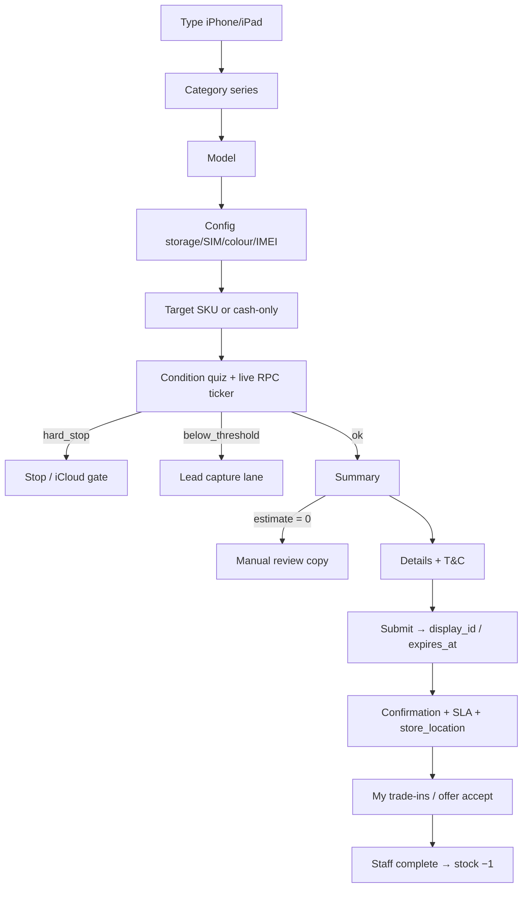

# Trade system handbook

BlackBox Ghana trade-in v2 — where money lives, how the flow works, cutover, and admin recipes.

---

## Flow diagram

Routes: `/trade/*` (v2). Legacy `/trades` redirects when `VITE_TRADE_V2_ENABLED` is on (default).

---

## Where every number lives

| Number | Source of truth | Admin UI |
|--------|-----------------|----------|
| Base trade-in value | `trade_base_values` (model × storage × `sim_variant`) | `/admin/trade/pricing` |
| Fault deductions | `trade_fault_deductions` | Pricing → deductions |
| Battery bands / replace policy | `trade_config` + engine in `compute_trade_estimate` | Config + battery migrations |
| Aesthetic A1 / A2 | `trade_config` (`aesthetic_a1_*`, `aesthetic_a2_*`) + overrides table | Aesthetics + Config |
| Global threshold | `trade_config` (`threshold_mode`, `threshold_value`, message) | Thresholds / Config |
| Per-model threshold | `trade_devices.threshold_value` | Thresholds worksheet — **TODO(D16-values)** until filled |
| Rounding | `trade_round` → GHS 5 | Config `rounding_ghs` |
| Validity days | `trade_config.estimate_validity_days` | Config |
| Offer SLA hours | `trade_config.offer_sla_hours` | Config |
| Store location card | `trade_config.store_location` | Config |
| Notification channel | `trade_config.notification_channel` | Config (`in_app` until ops provider) |
| Questionnaire text | `trade_questions` / `trade_answers` | Questionnaire |
| Target price / top-up | Server trigger `fn_trade_snapshot_target_price` on insert/target change | — (never trust browser) |
| Final offer | Staff `final_value` / `offered_price` on request | Request detail |

Client UI copy (labels, errors): `lib/tradeCopy.ts` only.

Money formatting: `formatGhs` in `lib/money.ts` only.

---

## Still-pending client items (tagged in code)

| Tag | Meaning | Code |
|-----|---------|------|
| **TODO(D8)** | Top-up payment method at BlackBox | `tradeCopy`, Summary, Confirmation |
| **TODO(D16-values)** | Per-model thresholds dormant until filled | Condition screen, Thresholds admin, engine test skip |
| **TODO(D1a)** | iPhone 15 1TB / 4650 inactive until confirmed | `TradeAdminPricing.tsx` header |
| **TODO(iPad-prices)** | iPad base values inactive until supplied | `TradeTypeScreen.tsx`, Pricing header |

---

## Feature flag & rollback

- **Flag:** `VITE_TRADE_V2_ENABLED` (default `true` when unset).
- **Rollback:** set `VITE_TRADE_V2_ENABLED=false` and redeploy — serves legacy `/trades`, stops redirect. Schema stays (additive).
- **Permanent (non-rollbackable):** duplicate trigger drops in production migrations — intentional; do not re-create old duplicate triggers.

---

## Cutover checklist

1. **Migrations (prod), same order** as branch — including:
   - trade valuation / client answers / battery bands
   - `2026_07_trade_expiry_and_notify.sql`
   - `2026_07_trade_snapshot_on_target_change.sql`
2. **Verifications green**
   - `npm run test:engine` (branch DB credentials)
   - `npm run test:rls` (anon + two test users)
   - Spot-check SQL §12g expects **2760** and **6300**
3. **Flip** `VITE_TRADE_V2_ENABLED=true` (or leave unset)
4. **Retire** old estimator: `/trades` → `/trade` redirect live; mobile nav points at `/trade`
5. **Monitor 48 h:** `audit_log`, `notifications`, offer accept rate, expiry sweep logs
6. **Rollback** = flag off only (see above)

---

## Admin how-to recipes

### Change a price
1. `/admin/trade/pricing`
2. Find model × storage × SIM (`ps` / `es`)
3. Edit `base_value` → Save (cache invalidates; live ticker uses new value)

### Add a question
1. `/admin/trade/questionnaire`
2. Add question + answers (outcomes: deduct / hard_stop / verify / none)
3. Drag `display_order`; set `help_text`
4. Customer quiz loads from DB — no deploy

### Set a threshold
1. Global: `/admin/trade/config` or Thresholds — mode percent/fixed + value + message
2. Per-model: Thresholds worksheet → `trade_devices.threshold_value` (**TODO(D16)** until client fills)

### Activate iPads
1. Seed / enter iPad rows in `trade_devices` + `trade_base_values`
2. Set `is_active = true` on devices with priced rows
3. Type screen auto-shows iPad card (`hasActiveIpadDevices`) — **TODO(iPad-prices)** until values exist

### Restock or switch target after OOS complete
1. Open request → Target stock
2. Pick in-stock product/variant (re-snapshots top-up)
3. Complete again — stock before/after should be −1

---

## Tests & QA

| Suite | Command | Notes |
|-------|---------|-------|
| Engine matrix | `npm run test:engine` | Needs service/anon + URL |
| RLS script | `npm run test:rls` | Two optional customer users |
| Edge cases | `docs/qa-edge-cases.md` | Expiry, OOS, notifications, IMEI race |

---

## Analytics

`lib/analytics.ts` → `track()` with `TRADE_ANALYTICS.*` constants (flow steps, quiz complete, threshold stop, estimate distribution, offer response). Console in DEV; `gtag` / `dataLayer` when present.
